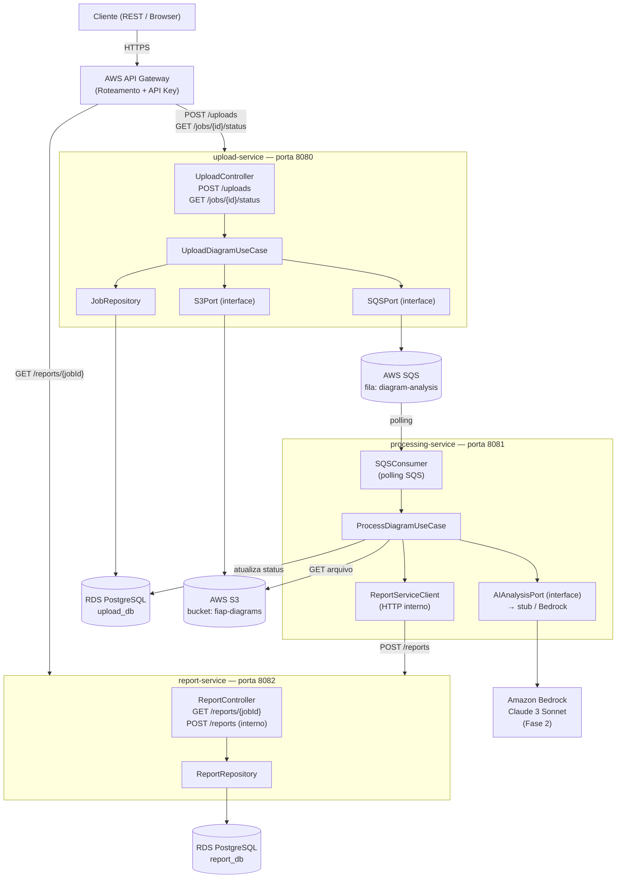
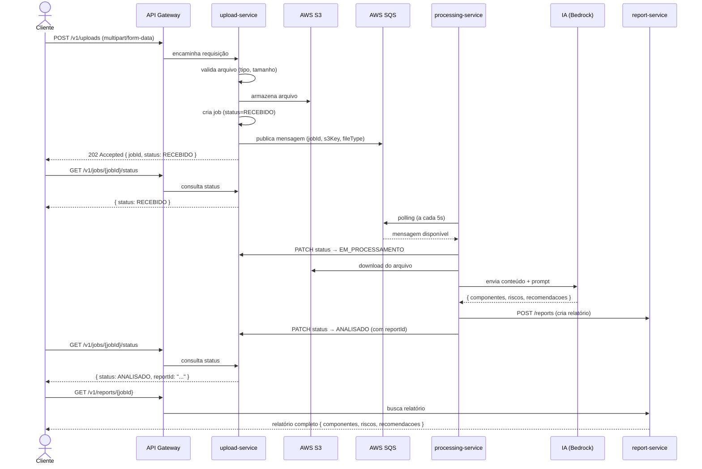

# Arquitetura — FIAP Secure Systems MVP

## Visão Geral

O sistema é composto por **3 microsserviços Spring Boot** orquestrados via **AWS API Gateway**, com comunicação assíncrona via **AWS SQS** e armazenamento de arquivos no **AWS S3**.

Cada serviço possui banco de dados próprio (**RDS PostgreSQL**), seguindo o princípio de isolamento de dados de microsserviços.

---

## Diagrama de Arquitetura



---

## Fluxo Principal



---

## Fluxo de Status do Job

```
RECEBIDO → EM_PROCESSAMENTO → ANALISADO
                           ↘ ERRO
```

| Status | Quem define | Quando |
|---|---|---|
| `RECEBIDO` | upload-service | Ao criar o job após salvar no S3 e publicar no SQS |
| `EM_PROCESSAMENTO` | processing-service | Ao consumir a mensagem da fila |
| `ANALISADO` | processing-service | Após receber resposta da IA e persistir relatório |
| `ERRO` | processing-service | Em caso de falha em qualquer etapa do processamento |

---

## Decisões Arquiteturais

### 1. Arquitetura Hexagonal por serviço
Cada serviço segue a arquitetura hexagonal (Ports & Adapters):
- **Domain**: entidades e casos de uso sem dependência de frameworks
- **Application**: orquestração dos casos de uso
- **Adapters (in)**: controllers REST, consumers SQS
- **Adapters (out)**: repositórios JPA, clientes S3, clientes SQS, clientes HTTP

### 2. Comunicação assíncrona via SQS
O upload não aguarda o processamento da IA (que pode levar segundos a minutos). A fila SQS desacopla os dois serviços e permite:
- Retry automático em caso de falha
- Dead Letter Queue (DLQ) para mensagens que falharam repetidamente
- Processamento em paralelo caso múltiplos consumers sejam adicionados

### 3. Banco de dados por serviço
- `upload_db`: exclusivo do upload-service (jobs, status, eventos)
- `report_db`: exclusivo do report-service (relatórios, componentes, riscos, recomendações)
- O processing-service **não possui banco próprio** — atualiza o `upload_db` via HTTP interno e persiste no `report_db` via report-service

### 4. API Gateway gerenciado (AWS)
Evita criar um serviço extra de roteamento. Responsabilidades:
- Roteamento para os serviços
- Validação de API Key (autenticação básica para o MVP)
- Rate limiting
- Logs de acesso no CloudWatch

### 5. Stub de IA na Fase 1 (SOAT)
O processing-service implementa a interface `AIAnalysisPort`. Na Fase 1, um adapter `StubAIAdapter` retorna dados mockados com a estrutura real do relatório. Na Fase 2, um `BedrockAIAdapter` substitui o stub sem alterar o restante da lógica.

---

## Estrutura de Pastas (por serviço)

```
{service-name}/
├── src/
│   ├── main/
│   │   ├── java/br/com/fiap/{service}/
│   │   │   ├── domain/
│   │   │   │   ├── model/          # Entidades e value objects
│   │   │   │   └── port/           # Interfaces (in e out)
│   │   │   ├── application/
│   │   │   │   └── usecase/        # Casos de uso
│   │   │   ├── adapter/
│   │   │   │   ├── in/
│   │   │   │   │   ├── web/        # Controllers REST
│   │   │   │   │   └── sqs/        # Consumers SQS
│   │   │   │   └── out/
│   │   │   │       ├── persistence/ # Repositórios JPA
│   │   │   │       ├── aws/         # Clientes S3, SQS
│   │   │   │       └── http/        # Clientes HTTP (Feign/RestClient)
│   │   │   └── config/             # Configurações Spring, AWS
│   │   └── resources/
│   │       ├── application.yml
│   │       └── db/migration/       # Scripts Flyway
│   └── test/
│       └── java/br/com/fiap/{service}/
│           ├── unit/
│           └── integration/
├── Dockerfile
└── pom.xml
```

---

## Infraestrutura AWS

| Recurso | Serviço AWS | Configuração |
|---|---|---|
| Armazenamento de arquivos | S3 | Bucket privado, server-side encryption (SSE-S3) |
| Fila de mensagens | SQS | Standard Queue + DLQ (maxReceiveCount: 3) |
| Banco de dados | RDS PostgreSQL 16 | db.t3.micro por serviço (MVP) |
| Containers | ECS Fargate | Task per service, Auto Scaling |
| Roteamento | API Gateway | REST API, stage: dev/prod |
| Secrets | Secrets Manager | Credenciais de DB, chaves de API |
| Logs | CloudWatch | Log groups por serviço, retenção 30 dias |
| Imagens Docker | ECR | Repositório por serviço |
| Rede | VPC | Private subnets para serviços e DBs, public para ALB |

---

## Segurança

| Ameaça | Mitigação |
|---|---|
| Arquivo malicioso no upload | Validação de MIME type + extensão; limite de tamanho (10MB) |
| Acesso não autorizado à API | API Key no API Gateway (MVP); plano futuro: Cognito |
| Dados em repouso | S3 SSE-S3; RDS encryption at rest |
| Dados em trânsito | HTTPS obrigatório; TLS entre serviços internos |
| Injeção via prompt (IA) | Guardrails de entrada e saída; validação de schema JSON |
| Alucinações da IA | Validação do JSON retornado; fallback para ERRO se inválido |
| Acesso entre serviços | IAM roles por serviço; Security Groups restritivos |
| DLQ e mensagens venenosas | DLQ configurada; alertas no CloudWatch |
